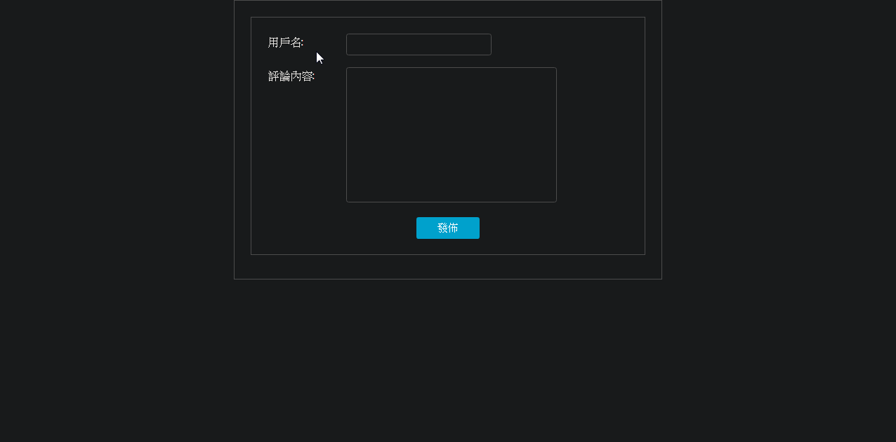
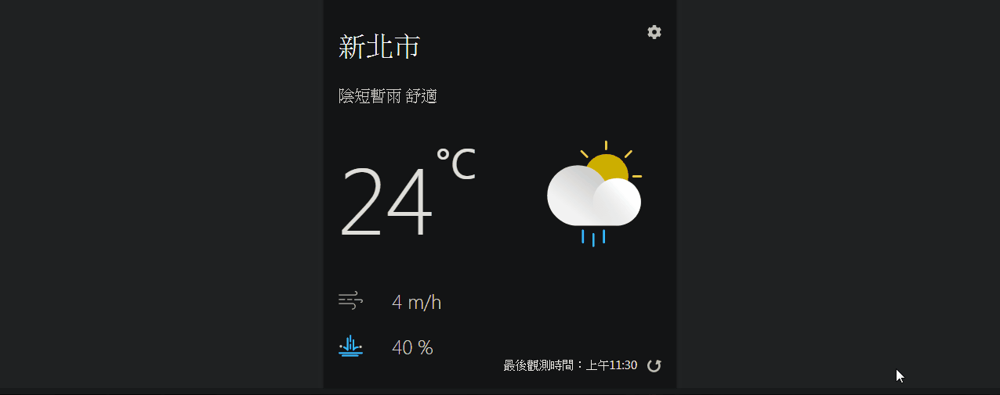

# React-To-Do-List
React Hooks建立組件

Live Demo:
https://v8661087.github.io/React-Works/#/To-Do-List

# React-CommentApp
Firebase後台，會員認證系統(登入/註冊)，Cloud Firestore即時資料庫。

Live Demo: https://v8661087.github.io/React-Works/#/CommentApp

# React-WeatherApp
串接中央氣象局API取得天氣資訊，選擇城市及主題並儲存至localstorage。 

Live Demo: https://v8661087.github.io/React-Works/#/WeatherApp 
參考https://ithelp.ithome.com.tw/users/20103315/ironman/2668?page=1